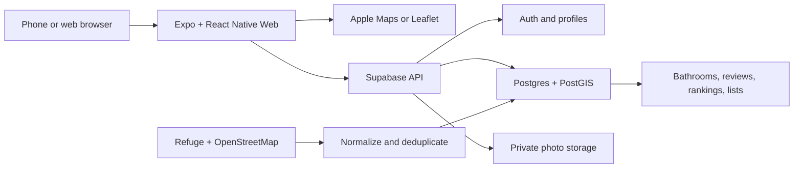

<p align="center">
  
</p>

<h1 align="center">Poopi</h1>

<p align="center">
  <strong>Find a bathroom you can trust before it becomes an emergency.</strong>
</p>

<p align="center">
  <a href="https://poopi-bathrooms.colin-hu2007.chatgpt.site">Live web app</a>
  ·
  <a href="plan/todo.md">Collaborator roadmap</a>
</p>

## Why Poopi exists

Nobody really wants to poop in public. Most people would rather wait until they
get home—but sometimes waiting is not an option. In that moment, knowing that a
bathroom exists is not enough. You want to know whether it is clean, private,
open, accessible, stocked, and worth walking to.

**Poopi is a crowdsourced bathroom finder and rating app inspired by Beli.**
Instead of ranking restaurants, people share structured feedback about the
bathrooms they actually used. That community knowledge helps the next person
find the closest bathroom that meets their needs, without pretending unknown or
outdated information is trustworthy.

## What you can do

- Explore nearby bathrooms on an interactive mobile-first map.
- Search for a venue or address, with nearby and punctuation-tolerant matching.
- Add a missing bathroom manually or from a suggested current venue.
- Rate cleanliness, smell, privacy, wait, access, and operating condition.
- Choose from 46 alphabetized good/bad labels after submitting a rating.
- Upload an empty-room or bathroom-sign photo for moderation.
- Read privacy-safe public reviews and recency-weighted summaries.
- Save bathrooms, report inaccurate information, and edit or delete your review.
- Compare bathrooms head-to-head to build a personal ranking.
- Open walking directions to the exact bathroom location.

## How it was built

Poopi is an Expo application that shares most of its product code across iOS
and the web. Its backend is Supabase, with PostGIS handling geographic data and
row-level security protecting private account and review fields.



### Technology

| Area | Technology |
|---|---|
| Client | Expo 56, React Native 0.85, React 19, Expo Router |
| Web map | Leaflet and OpenStreetMap |
| iOS map | Expo Maps / Apple Maps |
| Backend | Supabase Auth, Postgres, PostGIS, Storage, RLS, RPC functions |
| Data sources | Refuge Restrooms, OpenStreetMap, and user submissions |
| Language and tests | TypeScript 6, Node test runner through `tsx` |
| Web hosting | Static Expo web export packaged for OpenAI Sites |

### Trust and recommendation model

Poopi separates durable facts—such as wheelchair access or a changing table—from
temporary observations such as smell, cleanliness, wait, supplies, and whether
something is currently broken. Conditions carry timestamps, and recent reviews
matter more than old ones.

The recommendation model applies hard requirements first, then combines the
remaining signals:

$$
R = 0.30D + 0.25Q + 0.20P + 0.15F + 0.10W
$$

where $D$ is proximity, $Q$ is community quality, $P$ is preference match,
$F$ is freshness and confidence, and $W$ is expected wait. Personal rankings
use structured review scores and Elo-style pairwise comparisons. Community
ordering uses a regularized Bradley–Terry model with bounded contributor
weighting.

## How Codex with GPT-5.6 was used

Poopi was built as an iterative collaboration between **Colin Hu** and
**OpenAI Codex powered by GPT-5.6**. Colin created the original concept, chose
the product direction, supplied Beli references and phone screenshots, made the
feature decisions, configured external services, and tested each version.

Codex acted as the project's primary product-design and software-engineering
agent. Put simply: **Codex wrote most of the implementation in this repository,
under Colin's direction and review.**

GPT-5.6 was used to:

1. **Understand and plan the product** — audit the early app, turn the idea into
   a prioritized collaborator roadmap, and separate permanent bathroom facts
   from timestamped visit conditions.
2. **Design the experience** — translate Beli's rating and comparison patterns
   into a bathroom-specific, mobile-first flow; develop the label taxonomy;
   and iterate from real iPhone screenshots.
3. **Implement the application** — build and revise the map, search, details,
   rating, photo, profile, save, report, list, and ranking experiences across
   React Native and web.
4. **Build the data layer** — write Supabase migrations, PostGIS queries, RPCs,
   row-level security policies, normalization, deduplication, summaries, and
   privacy-safe review contracts.
5. **Develop the algorithms** — implement recency weighting, confidence and
   unknown states, recommendation ordering, Elo-style personal comparisons,
   and weighted community ranking.
6. **Debug the real product** — trace failures from screenshots and error
   reports, inspect live API contracts, repair migrations, and fix mobile layout,
   image, search, and persistence issues.
7. **Verify and ship changes** — maintain automated tests and type safety,
   create focused Git branches and pull requests, merge reviewed changes, and
   publish web builds for phone testing.

This was not a one-prompt code generation exercise. It was a long feedback loop:
Colin tried the app, explained what felt wrong, and Codex inspected, implemented,
tested, and shipped the next iteration. The commit and pull-request history
records that process.

## Challenges and lessons

### Crowdsourced data must admit uncertainty

The hardest product problem was not displaying a score—it was deciding when a
score deserved trust. Missing opening hours cannot mean “open,” and an old
confirmation cannot be shown as recent. Poopi therefore preserves explicit
`unknown` states, expires temporary conditions, and combines review volume,
freshness, and source confidence.

### One bathroom can appear in several datasets

Refuge, OpenStreetMap, place search, and user submissions may all describe the
same physical bathroom. Poopi normalizes sources into canonical UUID-backed
records and uses external IDs, names, and conservative geographic matching to
avoid splitting reviews across duplicates.

### Rating a missing place should still feel easy

A bathroom may exist inside a restaurant even when no bathroom marker exists.
The rating flow therefore searches nearby venues, suggests the current place
when location is available, lets the user correct the address and pin, and
persists the bathroom before attaching reviews or photos.

### Rankings need comparisons, not arbitrary extremes

A small set of structured ratings can produce misleadingly extreme numbers if
it is stretched across a full 1–10 scale. New bathrooms remain unranked until a
head-to-head comparison places them relative to an established bathroom.

### Privacy has to be structural

Public reviews are exposed through privacy-safe database functions. Private
notes and non-public visits remain owner-scoped, photo files use protected
storage, and account-bound writes are enforced in the database rather than only
hidden in the interface.

## Run Poopi locally

### Requirements

- Node.js 20 or newer
- npm
- A Supabase project

### Setup

```bash
git clone https://github.com/ColinHu07/poopi.git
cd poopi
npm install
cp .env.example .env
```

Add the public Supabase project values to `.env`:

```dotenv
EXPO_PUBLIC_SUPABASE_URL=your-project-url
EXPO_PUBLIC_SUPABASE_ANON_KEY=your-anon-key
```

Apply the SQL files in `supabase/migrations/` to the Supabase project in
timestamp order, then start the web app:

```bash
npm run web
```

Other useful commands:

```bash
npm run typecheck
npm test
npm run build:web
npm run ios
```

The repository currently contains **68 automated tests** covering access rules,
feedback contracts, summaries, map behavior, search, deduplication, ranking,
labels, photos, and privacy-sensitive database policies.

## Project status

Poopi is an active prototype. Its reliable finder, structured review, missing
bathroom, photo-upload foundation, and personal-ranking flows are implemented.
Custom lists, friends/social discovery, moderation tooling, broader end-to-end
coverage, and Android map parity remain future work.

For the current source of truth, ownership placeholders, dependencies, and
acceptance criteria, see [`plan/todo.md`](plan/todo.md).

## Credits

- **Product vision, direction, testing, and external-service setup:** Colin Hu
- **Primary design and implementation agent:** OpenAI Codex powered by GPT-5.6
- **Bathroom data:** Refuge Restrooms, OpenStreetMap, and Poopi contributors
- **Map data:** © OpenStreetMap contributors

Poopi is inspired by Beli's approachable rating and ranking experience, adapted
for a very different—and occasionally much more urgent—kind of discovery.
